<div align="center">

# 🦅 FLEDGE

### Forensic Live Evidence Data Gathering Engine

**A PowerShell-based forensic collection framework for live Windows systems**

<br>


<br>

> **Structured live-response collection of volatile, system, user, process, file, and network artifacts from Windows environments.**

</div>

---

## 🔎 Overview

**FLEDGE** — the **Forensic Live Evidence Data Gathering Engine** — is a PowerShell-based forensic collection project designed to support the structured acquisition of volatile and system-level artifacts from live Windows environments.

The objective is simple:

> **Collect useful point-in-time evidence while preserving a clear, organized acquisition structure for subsequent forensic review.**

All acquired artifacts are placed inside a timestamped **FLEDGE Nest** located at the root of the prepared collection drive.

```text
Collection Drive
│
└── FLEDGE_Nest - YYYYMMDD_HHMMSS
    │
    ├── collection_metadata.txt
    ├── collection.log
    │
    ├── System
    │   ├── system_info.txt
    │   └── time_information.txt
    │
    ├── Processes
    │   ├── tasklist.txt
    │   ├── pslist.txt
    │   └── process_details.csv
    │
    ├── Network
    │   ├── interfaces.csv
    │   ├── tcp_connections.csv
    │   ├── udp_endpoints.csv
    │   ├── dns_cache.csv
    │   ├── arp.csv
    │   └── routes.csv
    │
    ├── Users
    │   ├── logged_on.txt
    │   └── sessions.txt
    │
    ├── Services
    │   └── services.csv
    │
    ├── WiFi
    │   ├── interfaces.txt
    │   ├── networks.txt
    │   └── profiles.txt
    │
    └── Hashes
        ├── evidence_SHA256.csv
        └── collector_SHA256.csv
```

---

## 🪺 The FLEDGE Nest

<div align="center">

### You'll find all acquired data **Nested** in the root of your prepared collection drive.

</div>

FLEDGE creates a structured collection location so artifacts from each execution remain grouped together and identifiable by collection time.

This assists with:

* 🗂️ **Collection organization**
* 🕒 **Point-in-time documentation**
* 🔍 **Subsequent forensic examination**
* 🔐 **Integrity verification**
* 📝 **Reporting and case documentation**

---

## ⚠️ Before You Run FLEDGE

> [!IMPORTANT]
> **FLEDGE is intended for authorized forensic, incident-response, investigative, and academic use only.**

### 1. Accept Dependency EULAs

Before field use, manually execute and accept the applicable EULAs for programs contained within the `Dependencies` directory.

> [!WARNING]
> Dependency EULAs should be accepted **before arriving at the target system** whenever operationally appropriate.

---

### 2. Run With Administrative Privileges

FLEDGE should be executed from an **elevated PowerShell session**.

```powershell
Run as Administrator
```

Administrative privileges may be required to access certain system, process, networking, and forensic artifacts.

---

### 3. Enable Windows Location Services When Required

Some Windows WLAN commands require **Location Services** permission before wireless network information can be queried.

If WLAN information is required:

```text
Settings
   └── Privacy & security
       └── Location
           └── Location services → On
```

Without this permission, some wireless-network collection commands may return incomplete results or access errors.

---

### 4. Minimize Investigator-Generated Network Traffic

When conducting a live network survey, limit unnecessary background communications originating from the examiner's equipment.

Examples include:

* Cloud synchronization
* Automatic updates
* Personal mobile devices
* Streaming services
* Unnecessary browser sessions
* Background applications
* Other devices connected to the same investigative network

> [!TIP]
> A quieter collection environment reduces investigator-generated network artifacts and makes subsequent interpretation easier.

---

## 🔐 Evidence Integrity

> [!CAUTION]
> **Verify collected evidence using cryptographic hashes after acquisition.**

At minimum:

1. Complete the FLEDGE collection.
2. Hash the collected output.
3. Record the resulting hash values.
4. Hash subsequent forensic copies.
5. Compare hashes to verify copy integrity.

Example:

```powershell
Get-FileHash .\EvidenceFile.bin -Algorithm SHA256
```

For directories containing multiple collected artifacts, generate and preserve a hash manifest when appropriate.

> **Acquisition → Hash → Copy → Rehash → Verify**

---

## 🌐 Live Network Collection

Depending on configuration and available dependencies, FLEDGE may assist with collection of information such as:

```text
┌─────────────────────────────────────────┐
│          LIVE NETWORK SNAPSHOT          │
├─────────────────────────────────────────┤
│  Default Gateway                        │
│  Local Interface Configuration          │
│  ARP / Neighbor Information             │
│  Reachable Hosts                        │
│  Active Connections                     │
│  Wireless Network Information           │
└─────────────────────────────────────────┘
```

Network results should always be interpreted as a **point-in-time observation**.

Host availability, ARP tables, open connections, processes, users, and other volatile artifacts may change immediately after acquisition.

---

## 🖥️ Live Host Collection

FLEDGE is intended to assist with acquisition of live system-state information such as:

| Artifact Category     | Examples                                                |
| --------------------- | ------------------------------------------------------- |
| 🖥️ **System**        | OS, hostname, hardware, configuration                   |
| 👤 **Users**          | Local users, sessions, logged-on users                  |
| ⚙️ **Processes**      | Running processes and associated information            |
| 📂 **Files**          | Open files and relevant filesystem information          |
| 🌐 **Network**        | Interfaces, connections, gateway, ARP                   |
| 🔌 **Services**       | Running services and system components                  |
| 📜 **Logs**           | Selected operating-system and diagnostic data           |
| 🧠 **Volatile State** | Information that may change or disappear after shutdown |

---

## 📝 Example Report Language

The following is an example of how collection activity performed using FLEDGE could be described in an investigative or forensic report:

> A live network survey was conducted using PowerShell scripts and Microsoft Sysinternals utilities to identify the default gateway, enumerate devices observed through ARP data, and identify responsive hosts through ICMP probing. A live survey of logged-on users, open files, active processes, and running processes was also conducted. The resulting information represents a point-in-time snapshot of the network environment and system state at the time of collection.

> [!NOTE]
> Report language should always be modified to accurately describe the **specific commands, tools, artifacts, results, limitations, and investigative circumstances** associated with the examination.

---

## 🧭 Recommended Collection Workflow

```mermaid
flowchart LR
    A[Prepare Collection Media] --> B[Accept Dependency EULAs]
    B --> C[Launch Elevated PowerShell]
    C --> D[Execute FLEDGE]
    D --> E[Collect Live Artifacts]
    E --> F[Review FLEDGE Nest]
    F --> G[Generate SHA-256 Hashes]
    G --> H[Preserve Original Collection]
    H --> I[Create Working Copy]
    I --> J[Verify Copy Hashes]
    J --> K[Forensic Examination]
```



---

## ⚖️ Authorized Use Only

FLEDGE is designed for legitimate:

* Digital forensics
* Incident response
* Cyber investigations
* Security research
* Laboratory testing
* Training
* Academic use

Users are responsible for confirming that they possess all required **legal authority, consent, organizational approval, warrants, policies, or other authorization** before collecting data from a system or network.

---

## 📜 Legal Notice

> [!WARNING]
> **FLEDGE is provided for legitimate DFIR and academic purposes only.**
>
> Users are solely responsible for ensuring that they possess the necessary legal authority and authorization before using FLEDGE against any computer system, storage device, account, or network.
>
> The author assumes no responsibility or liability for misuse, unauthorized use, improper collection, evidentiary handling, operational impact, or violations of applicable law or policy resulting from use of this software.

---

<div align="center">

### 🦅 FLEDGE

**Forensic Live Evidence Data Gathering Engine**

`COLLECT • NEST • HASH • VERIFY • ANALYZE`

<br>

**For Authorized Use Only**

</div>
